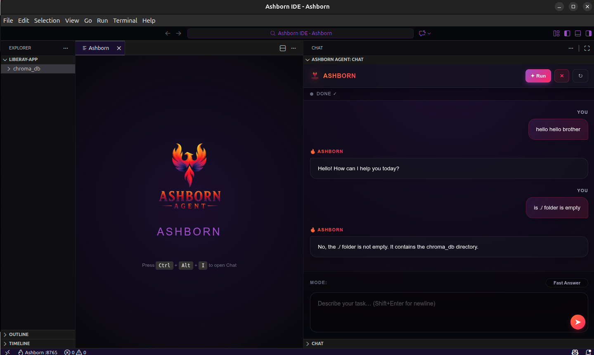
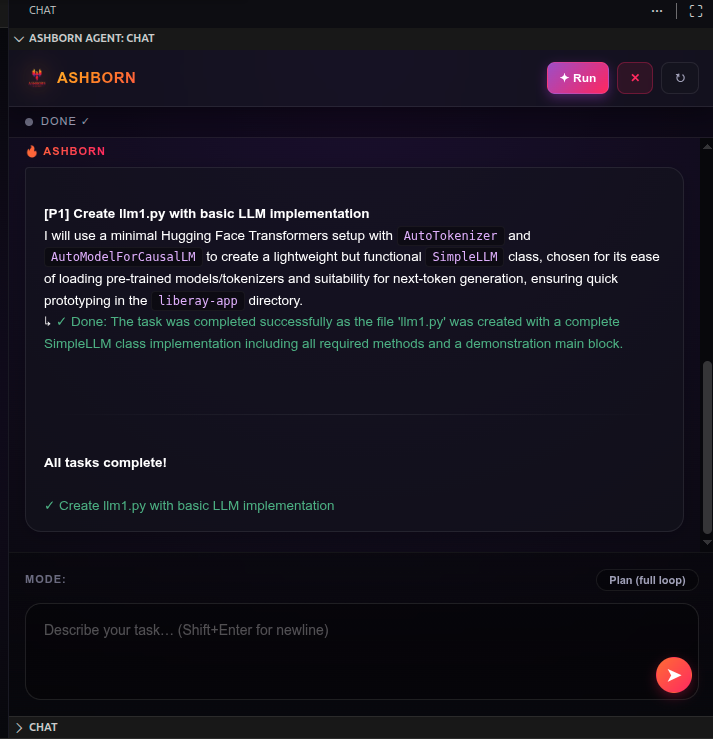
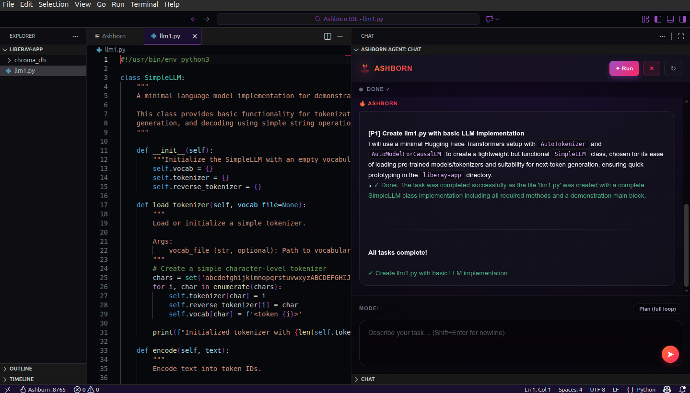
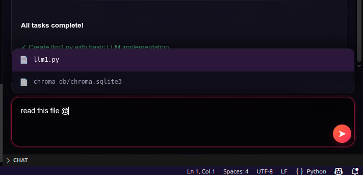
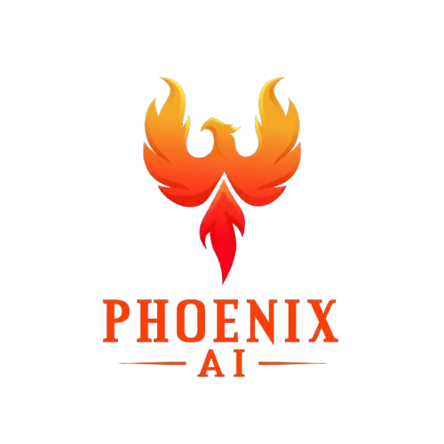

<p align="center">
  
</p>

<h1 align="center">
  A S H B O R N &nbsp; A G E N T
</h1>

<p align="center">
  <em>The Ultimate Autonomous Architect — Think. Plan. Execute. Reflect.</em>
</p>

<p align="center">
  <a href="#-quickstart"></a>&nbsp;
  <a href="#-features"></a>&nbsp;
  <a href="#-documentation"></a>
</p>

<p align="center">
  
  
  
  
  
</p>

<br>

<p align="center">
  
</p>

---

<br>

## 🔥 What is Ashborn?

**Ashborn** is a fully autonomous AI development agent that transforms natural-language intent into production-ready code. It doesn't just generate — it **thinks**, **plans**, **executes**, and **reflects** through a sophisticated multi-phase cognition loop, delivering surgical precision even on complex, multi-file projects.

Built on the high-performance **Phoenix AI Framework**, Ashborn ships as both a **standalone IDE** (powered by VSCodium) and a **cinematic terminal interface** — giving you the freedom to work wherever you're most productive.

<br>

<table>
<tr>
<td width="50%" valign="top">

### 🧠 Not Just Another Copilot

Unlike code completion tools that react to keystrokes, Ashborn operates at a **project level**. Give it a goal, and it will:

- Decompose it into discrete tasks
- Generate execution plans with dependency ordering
- Write, edit, and test files autonomously
- Self-evaluate results and iterate

</td>
<td width="50%" valign="top">

### ⚡ Built for Real Work

Ashborn is designed for professional-grade output:

- **Surgical file editing** — no "rewrite the whole file"
- **User approval gates** for destructive actions
- **Streaming feedback** so you see every thought
- **Resume-capable** state persistence

</td>
</tr>
</table>

<br>

---

<br>

## ✨ Features

<table>
<tr>
<td align="center" width="25%">
  <br>
  <br>
  <b>Multi-Phase Cognition</b><br>
  <sub>Think → Plan → Generate → Act → Reflect</sub><br><br>
</td>
<td align="center" width="25%">
  <br>
  <br>
  <b>Surgical Code Editing</b><br>
  <sub>Line-range & search/replace precision</sub><br><br>
</td>
<td align="center" width="25%">
  <br>
  <br>
  <b>Dual Interface</b><br>
  <sub>Standalone IDE + Cinematic TUI</sub><br><br>
</td>
<td align="center" width="25%">
  <br>
  <br>
  <b>Safety-First Execution</b><br>
  <sub>Approval gates & forbidden patterns</sub><br><br>
</td>
</tr>
<tr>
<td align="center" width="25%">
  <br>
  <br>
  <b>Real-Time Streaming</b><br>
  <sub>SSE-powered live thought feed</sub><br><br>
</td>
<td align="center" width="25%">
  <br>
  <br>
  <b>Persistent State</b><br>
  <sub>Backbone context file for resume</sub><br><br>
</td>
<td align="center" width="25%">
  <br>
  <br>
  <b>Voice I/O</b><br>
  <sub>Speech-to-text & text-to-speech</sub><br><br>
</td>
<td align="center" width="25%">
  <br>
  <br>
  <b>Extensible Tools</b><br>
  <sub>Drop-in tool registration system</sub><br><br>
</td>
</tr>
</table>

<br>

---

<br>


## ⚡ Quickstart

### Prerequisites

| Requirement | Version |
| :--- | :--- |
| 🐍 Python | `>= 3.10` |
| 📦 pip | Latest |
| 🐧 OS | Linux (Ubuntu/Debian/Arch) |

### 1 · Clone & Setup

```bash
git clone https://github.com/your-org/ashborn-agent.git
cd ashborn-agent

# Create virtual environment
python3 -m venv venv
source venv/bin/activate

# Install dependencies
pip install -e .
pip install -r requirements.txt
```

### 2 · Configure

Create a `.env` file in the project root:

```env
OPENAI_API_KEY=your_api_key_here
OPENAI_BASE_URL=https://api.openai.com/v1
OPENAI_LLM_MODEL=gpt-4o
```

### 3 · Launch

<table>
<tr>
<td width="50%">

**🖥️ Terminal Mode (TUI)**

```bash
ashborn .
```

</td>
<td width="50%">

**🏢 IDE Mode (Standalone)**

```bash
python launch.py .
```

</td>
</tr>
</table>

### 4 · Server Only (API Mode)

```bash
uvicorn ashborn.server:app --host 127.0.0.1 --port 8765
```

<br>

---

<br>

## 🌐 API Reference

Ashborn exposes a RESTful API for programmatic integration.

<details>
<summary><b>💬 Chat & Agent</b></summary>

<br>

| Method | Endpoint | Description |
| :---: | :--- | :--- |
| `POST` | `/chat/stream` | Stream agent response (SSE) |
| `POST` | `/tool/result` | Return VS Code tool call result |
| `POST` | `/reset` | Reset the current session |

**Stream a request:**
```bash
curl -N -X POST http://localhost:8765/chat/stream \
  -H "Content-Type: application/json" \
  -d '{"task": "Create a Flask REST API", "mode": "plan"}'
```

</details>

<details>
<summary><b>💡 Code Intelligence</b></summary>

<br>

| Method | Endpoint | Description |
| :---: | :--- | :--- |
| `POST` | `/completion` | Inline code completion |
| `POST` | `/code_action` | Explain / Refactor / Optimize / Fix |

</details>

<details>
<summary><b>⚙️ Configuration</b></summary>

<br>

| Method | Endpoint | Description |
| :---: | :--- | :--- |
| `GET` | `/config` | Get current configuration |
| `POST` | `/config` | Update `.env` and re-init agent |

</details>

<details>
<summary><b>🎤 Media (Voice)</b></summary>

<br>

| Method | Endpoint | Description |
| :---: | :--- | :--- |
| `POST` | `/tts` | Text-to-speech (gTTS → base64 MP3) |
| `POST` | `/stt/start` | Start microphone recording |
| `POST` | `/stt/stop` | Stop recording & transcribe |

</details>

<details>
<summary><b>❤️ Health</b></summary>

<br>

| Method | Endpoint | Description |
| :---: | :--- | :--- |
| `GET` | `/health` | Server & agent readiness check |

```bash
curl http://localhost:8765/health
# → {"status": "ok", "agent_ready": true}
```

</details>

<br>

---

<br>

## 🔧 Agent Tools

Ashborn ships with a curated set of tools the agent uses autonomously:

| Tool | Description |
| :--- | :--- |
| 📖 `file_read_lines` | Read file with line numbers for precise targeting |
| ✏️ `file_update_multi` | Surgical multi-block edits (line-range + search/replace) |
| 📝 `file_write` | Create new files with automatic directory creation |
| 🔍 `vscode_search` | Workspace-wide regex search via VS Code |
| 📂 `vscode_create_file` | Create files through the IDE bridge |
| 🔄 `vscode_edit_file` | Edit files with diff preview & user approval |
| 🗑️ `vscode_delete_file` | Delete files with confirmation prompt |
| 💻 `vscode_terminal_run` | Execute terminal commands via VS Code |
| 🏗️ `project_generator` | Scaffold entire project structures from a dict manifest |
| ⚙️ `terminal` | Sandboxed bash execution with security guards |

<br>

---

<br>

## 📸 Screenshots

<table>
<tr>
<td width="50%" align="center">
  <br>
  <sub><b>Ultra-Premium IDE Interface</b></sub>
</td>
<td width="50%" align="center">
  <br>
  <sub><b>Cinematic Terminal Experience</b></sub>
</td>
</tr>
<tr>
<td width="50%" align="center">
  <br>
  <sub><b>Phoenix AI Cognition Core</b></sub>
</td>
<td width="50%" align="center">
  <br>
  <sub><b>Autonomous Workflow Cycle</b></sub>
</td>
</tr>
</table>

<br>

---

<br>

## 📦 Distribution

### Build a Distributable Package

```bash
bash scripts/package.sh
```

Outputs a production-ready archive at `dist/ashborn-ide-linux.tar.gz` containing the extension, backend, and one-step installer.

### Install from Bundle

```bash
tar -xzf ashborn-ide-linux.tar.gz
bash install.sh
```

> The installer handles VSCodium download, Python venv creation, and desktop integration automatically.

<br>

---

<br>

<!-- ══════════════════════════════════════════════════════════════════════════ -->
<!-- POWERED BY PHOENIX AI — Premium Announcement Card                       -->
<!-- ══════════════════════════════════════════════════════════════════════════ -->

<br>

<div align="center">

<table>
<tr>
<td>

<br>

<p align="center">
  
</p>

<h2 align="center">
  &nbsp;&nbsp;Phoenix AI Framework
</h2>

<p align="center">
  <em>🔥 A production-ready, modular backend infrastructure SDK<br>designed for AI-powered Python services.</em>
</p>

<br>

<table align="center">
<thead>
<tr>
<th align="center">🧩 Module</th>
<th align="left">Description</th>
</tr>
</thead>
<tbody>
<tr><td align="center"><code>phoenix.agent</code></td><td>Agent lifecycle, autonomous loop orchestration & tool dispatch</td></tr>
<tr><td align="center"><code>phoenix.cognition</code></td><td>Thinker, Planner & Reflector — modular reasoning base classes</td></tr>
<tr><td align="center"><code>phoenix.llm</code></td><td>High-performance streaming LLM interface (OpenAI-compatible)</td></tr>
<tr><td align="center"><code>phoenix.memory</code></td><td>Semantic memory, vector storage & context management</td></tr>
<tr><td align="center"><code>phoenix.tools</code></td><td>Extensible tool system with built-in FileRead, FileEdit & more</td></tr>
</tbody>
</table>

<br>

<p align="center">
  
  
  
  
</p>

<br>

</td>
</tr>
</table>

</div>

<br>

---

<br>

## 📖 Documentation

| Resource | Description |
| :--- | :--- |
| [🚀 Quickstart](#-quickstart) | Get up and running in 2 minutes |
| [🌐 API Reference](#-api-reference) | All REST endpoints documented |
| [🔧 Tools](#-agent-tools) | Agent tool capabilities |
| [📦 Distribution](#-distribution) | Build & ship packages |

<br>

---

<br>

## 🤝 Contributing

Contributions are welcome! The modular architecture makes it easy to add new capabilities:

- **New Brain Module** → Add to `ashborn/cognition/brains/`
- **New Tool** → Create in `ashborn/tools/` and register in `agent.py`
- **New API Route** → Add a `routes_*.py` in `ashborn/backend/`
- **New Prompt** → Add to `ashborn/cognition/core/prompts.py`

<br>

---

<br>

## 📜 License

This project is licensed under the **MIT License** — see the [LICENSE](LICENSE) file for details.

<br>

---

<p align="center">
  
  <br><br>
  <strong>A S H B O R N</strong><br>
  <sub>The Ultimate Autonomous Architect</sub><br><br>
  <sub>Built with 🔥 by <a href="#">Mohammed Alaa</a></sub><br>
  <sub>Powered by <b>Phoenix AI Framework</b></sub>
</p>