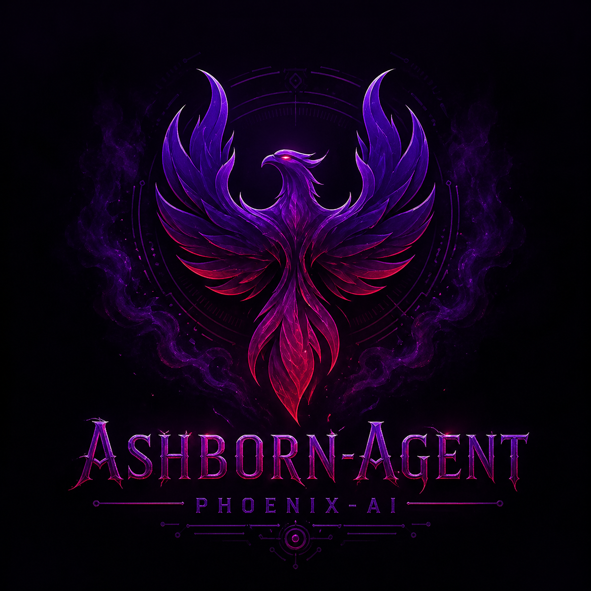

<h1 align="center">🐦‍🔥 Ashborn Agent</h1>

<p align="center">
  
</p>

<p align="center">
  <strong>The Ultimate Autonomous Architect Powered by Phoenix AI</strong>
</p>

<p align="center">
  
  
  
  
</p>

---

### 🌌 Manifest Your Vision
**Ashborn** is a state-of-the-art autonomous agent designed to manifest complex visions into production-ready code. Built on the high-performance **Phoenix AI Framework**, Ashborn leverages a parallel cognition cycle to think, plan, act, and reflect with unprecedented efficiency.

---

## Key Features

- **Advanced Cognition**: Parallel Awareness (Think + Analyze) for deep understanding of user intent and workspace context.
- **Autonomous Planning**: Multi-step planning with a self-correcting **Reflection** loop to ensure precision.
- **Parallel Execution**: Execute multiple tools simultaneously to speed up complex development workflows.
- **Premium Golden Aura UI**: A stunning TUI experience with golden outlines, cinematic transitions, and a great aura.
- **Hybrid Memory**: Long-term and short-term memory systems powered by vector databases and semantic search.
- **Project Scaffolding**: Instantly generate production-ready microservices, CLIs, and full-stack applications.

---

## 🎨 Premium UI Experience

Ashborn features the **Golden Aura** design system, providing a high-end terminal experience that feels alive:
- **Cinematic Splash Screen**: A stunning launch sequence to set the mood.
- **Golden Outlines**: Subtle, elegant golden borders and outlines for all main panels.
- **Animated Thinking Spinner**: A custom Braille-based spinner with a golden "aura" while processing.
- **Real-time Markdown**: Beautifully rendered markdown with syntax highlighting and token-by-token streaming.

---

## 🚀 Getting Started

### Prerequisites
- **Python 3.10+**
- **Phoenix AI Framework**
- **OpenAI API Key** (or a compatible provider)

### Installation

1. **Clone the repository**
   ```bash
   git clone https://github.com/blackeagle686/ashborn-agent.git
   cd ashborn-agent
   ```

2. **Set up your environment**
   Create a `.env` file in the root directory:
   ```env
   OPENAI_API_KEY=your_api_key_here
   OPENAI_LLM_MODEL=gpt-4o
   ```

3. **Install dependencies**
   ```bash
   pip install -e .
   ```

---

## 🛠️ Usage

### Interactive Mode
Launch the full-screen interactive chat interface:
```bash
python -m ashborn.main
```

### Direct Project Generation
Quickly scaffold a new project with a single command:
```bash
python -m ashborn.main generate "my-awesome-api" "python_microservice"
```

---

## 🏗️ Architecture

Ashborn is built exclusively on the **Phoenix AI Framework**, utilizing its core modules for maximum performance:

| Module | Responsibility |
| :--- | :--- |
| **`phoenix.agent`** | Orchestrates the autonomous loop and tool usage. |
| **`phoenix.cognition`** | Powers the Thinker, Planner, and Reflector modules. |
| **`phoenix.llm`** | High-performance streaming interface for LLM providers. |
| **`phoenix.memory`** | Advanced semantic memory and vector storage management. |

For a comprehensive deep-dive into the underlying architecture and advanced features, see the **[Phoenix AI Framework Guide](ashborn/phoneix-updates-notes.md)**.


---

## 📜 License
This project is licensed under the **MIT License**. See the [LICENSE](LICENSE) file for details.

<p align="center">
  <br>
  <i>Built with ❤️ by the Ashborn Team</i>
  <br>
  <b>Manifesting the Future of AI Development</b>
</p>